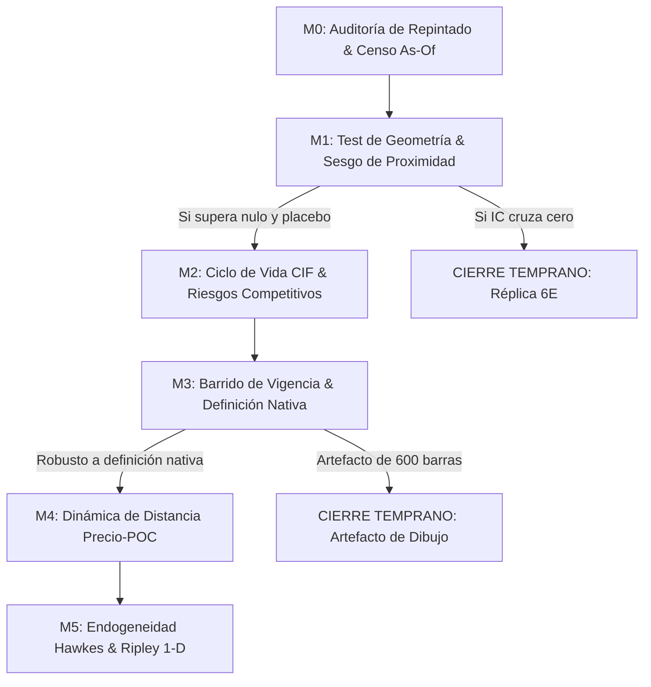

# Plan Modular del Embudo de Clusters HFT (NQ) y Crítica Integral

> **Fecha:** 2026-09-07  
> **Origen:** Continuación y cierre del workflow `plan-hft-cluster-funnel` interrumpido en sesión previa.  
> **Referencia central:** `docs/research/deep_research/DEEP_RESEARCH_HFT_CLUSTER_MAGNETISMO_2026-09-07.md`  
> **Handoff rector:** `docs/research/HANDOFF_2026-09-07_CLUSTERS_HFT_Y_AUDITORIA_EMA.md`  

---

## 1. Punto de partida y reanudación del trabajo

El workflow original de diseño y mapeo (`plan-hft-cluster-funnel`) se interrumpió a las 11:40 a. m. por agotamiento de créditos en el entorno de Claude. El estado exacto al momento del corte fue:
1. **Fase 1 (Mapa)**: 
   - Lectores 1 (`indicador`), 3 (`bridge`) y 5 (`precedente 6E`) completaron y persistieron sus resultados estructurados.
   - Lectores 2 (`paridad y oráculos`) y 4 (`toolkit estadístico`) ejecutaron 62 y 57 comandos respectivamente, relevando contratos, oráculos, incidentes, Aalen-Johansen CIF y scripts del repo, pero se cortaron antes de sintetizar el esquema. Sus hallazgos fueron rescatados íntegramente de sus trazas en `.claude/projects/`.
2. **Fase 2 (Diseño Modular)**: No llegó a ejecutarse.
3. **Fase 3 (Crítica Tripartita)**: No llegó a ejecutarse.

Este documento ejecuta las Fases 2 y 3 pendientes, estructurando el embudo de 7 escalones en módulos con **valor propio independiente** (requisito de Nico) y sometiendo el plan a tres lentes críticos (Completitud, Factibilidad NT8 y Validez Estadística).

---

## 2. Fase 2 — Diseño del Plan Modular

### Principio de diseño de Nico
> *"Tiene que ser una medición en embudo y modular, es decir, las partes independientemente aportan valor, y a su vez los módulos base de investigación sirven para los siguientes."*

Para cumplir esto, ningún módulo es un simple "trámite habilitador". Cada módulo entrega un producto analítico con significado propio aun si la hipótesis se refuta o la investigación se cierra inmediatamente después.

---

### Módulo M0: Auditoría de Repintado y Censo As-Of de Clusters
- **Escalón del embudo:** Escalón 0 (Prerrequisito físico).
- **Unidad de análisis:** Eventos (nacimiento, expansión, fusión).
- **Valor propio independiente:** Certifica con rigor numérico si el indicador que el trader observa en pantalla durante la sesión es el mismo que existía en tiempo real en la barra $t$, o si es un espejismo retrospectivo. Es una auditoría de integridad aplicable a cualquier indicador visual de NinjaTrader.
- **Entregable concreto:** 
  1. Parche de emisión append-only en `HFTZonesNQPureV4.cs`.
  2. Dataset parquet `cluster_events_asof.parquet` generado en NinjaTrader.
  3. Informe `docs/research/AUDITORIA_REPINTADO_CLUSTERS_HFT_V4.md` con fracción de distorsión geométrica y de recuento.
- **Dependencias:** Ninguna (punto de entrada).
- **Habilita:** Módulos M1 a M5 (provee el censo de verdad temporal).
- **Cambios mínimos en el indicador (`HFTZonesNQPureV4.cs`):**
  - Agregar método `EmitirEventoCluster(tipo, id, lower, upper, poc, count)` que escribe en SQLite o CSV append-only cada vez que un cluster nace, muta o se expande.
  - No guardar snapshots por barra en NT8 (explotaría el I/O con ~30.000 barras/día); emitir únicamente **eventos de transición de estado**. Python reconstruye el estado barra a barra en memoria.
- **Criterio de aceptación:** 100% de reproducibilidad bit a bit del log de eventos entre dos pasadas idénticas sobre el mismo feed de ticks. Tasa de mutación retrospectiva cuantificada.
- **Cómo podría refutarse:** Si > 15% de los clusters cambian su POC o sus límites retroactivamente en más de 2 ticks tras su detección inicial, el objeto dibujado se declara no-as-of y la investigación solo puede operar sobre el evento en su barra de nacimiento.
- **Riesgo principal:** Cuello de botella de I/O en NT8 si no se usa buffer concurrente. Se mitiga con cola de escritura en memoria ya existente en V4 (`zoneBuf`).
- **Esfuerzo:** Medio (1–2 días).

---

### Módulo M1: Test de Geometría Base y Sesgo de Proximidad
- **Escalón del embudo:** Escalón 1.
- **Unidad de análisis:** Eventos (nacimiento de cluster $\to$ primer toque).
- **Valor propio independiente:** Responde a la pregunta fundamental de mercado: *"¿Los niveles donde hubo ráfagas HFT atraen al precio más de lo que lo atrae cualquier línea arbitraria a la misma distancia?"*. Aísla si hay contenido informativo o si es pura geometría browniana.
- **Entregable concreto:**
  1. Runner Python `tools/test_cluster_proximity_null.py`.
  2. Contraste pareado contra:
     - Nulo browniano cerrado: $P(\text{tocar}) = 2(1 - \Phi(d / (\sigma_t \sqrt{h})))$.
     - Placebo geométrico reflejado a distancia $-d$ en el mismo instante $t$.
  3. Acta de decisión con IC bootstrap por bloques (95%).
- **Dependencias:** M0 (censo de clusters limpios).
- **Habilita:** M2 (si el contraste es positivo); Cierre de la línea (si cruza cero).
- **Piezas reutilizadas:** 
  - `diag/tasa_senales/avolcluster_tick_formal.py` (`tick_first_touch_race`).
  - `from statistics import NormalDist` para $\Phi(z)$ (sin dependencia de `scipy`).
  - `edgelab/stats/bootstrap_estacionario.py`.
- **Criterio de aceptación:** $\Delta_{\text{toque}} = P(\text{cluster}) - P(\text{placebo}) > 0$ con límite inferior del IC 95% $> 0$.
- **Cómo podría refutarse:** Si el intervalo bootstrap de $\Delta_{\text{toque}}$ contiene al cero, la atracción observada queda explicada por el sesgo de proximidad y la volatilidad local. **La línea se cierra aquí (réplica del 6E).**
- **Esfuerzo:** Chico (1 día).

---

### Módulo M2: Ciclo de Vida y Riesgos Competitivos (CIF Aalen-Johansen)
- **Escalón del embudo:** Escalón 2.
- **Unidad de análisis:** Eventos (nacimiento $\to$ desenlace competitivo).
- **Valor propio independiente:** Describe empíricamente cómo muere una zona de confluencia: ¿el precio va al POC, rompe la zona invalidándola, o la sesión termina sin interactuar? Entrega las probabilidades reales de interacción sin el sesgo optimista de Kaplan-Meier.
- **Entregable concreto:**
  1. Script `tools/cluster_lifecycle_cif.py`.
  2. Curvas de Incidencia Acumulada (CIF) para tres causas en competencia:
     - Causa 1: Toque del POC.
     - Causa 2: Invalidación (precio cruza el extremo opuesto).
     - Causa 3: Censura (cierre de sesión CME).
  3. Hazard ratio causa-específico frente a niveles placebo.
- **Dependencias:** M0, M1.
- **Habilita:** M3 (establece la vida media real para calibrar la vigencia).
- **Piezas reutilizadas:**
  - `diag/tasa_senales/F1_supervivencia_y_deplecion.py:84` (`aalen_johansen`).
- **Criterio de aceptación:** La probabilidad acumulada de tocar el POC supera estadísticamente a la de invalidación en horizontes menores a la vida media del cluster.
- **Cómo podría refutarse:** Si la CIF de invalidación domina a la de toque en todos los horizontes, el cluster no actúa como imán sino como zona de quiebre/aceleración.
- **Esfuerzo:** Chico (1 día, estimador ya implementado).

---

### Módulo M3: Barrido de Vigencia y Regla de Vida Nativa
- **Escalón del embudo:** Escalón 3.
- **Unidad de análisis:** Eventos rederivados bajo mallas de vigencia.
- **Valor propio independiente:** Elimina el Defecto D1. Demuestra si la confluencia es una propiedad intrínseca del mercado o un artefacto de haber elegido dibujar 600 barras (`ExtensionDibujo`). Establece una definición nativa falsable e independiente de la plataforma gráfica (regla P-52).
- **Entregable concreto:**
  1. Matriz de sensibilidad de $\Delta_{\text{toque}}$ barriendo vigencia en $[50, 100, 200, 400, 600, 800, 1200]$ barras.
  2. Definición y evaluación de **Vigencia Nativa por Invalidación de Precio** (la zona vive hasta que el precio la atraviesa en $K$ ticks, no por tiempo).
- **Dependencias:** M1, M2.
- **Habilita:** M4 (fija la población definitiva de clusters para el análisis denso de estado).
- **Criterio de aceptación:** El signo y significancia de $\Delta_{\text{toque}}$ se mantienen estables bajo la regla de invalidación por precio.
- **Cómo podría refutarse:** Si el efecto solo es positivo alrededor de 600 barras y colapsa con 300 o bajo invalidación por precio, se declara **artefacto de dibujo** y se descarta.
- **Esfuerzo:** Medio (1–2 días de cómputo en batch).

---

### Módulo M4: Dinámica de la Distancia Precio–POC (Unidad ESTADO)
- **Escalón del embudo:** Escalón 4.
- **Unidad de análisis:** ESTADO (panel denso barra a barra, con cluster activo).
- **Valor propio independiente:** Modela el movimiento continuo: ¿hay aceleración o atracción gravitacional conforme el precio se aproxima al POC, o la velocidad es indistinguible del ruido y de la reversión a la media habitual?
- **Entregable concreto:**
  1. Panel materializado mediante `edgelab/bridge/features.py` (distancia al POC activo, $\Delta \text{distancia}$, régimen de volatilidad $\sigma$).
  2. Estimador de drift condicional $\mathbb{E}[\Delta d \mid d, \sigma]$ vs placebo.
  3. Inferencia con bootstrap de bloques clusterizado por sesión (Politis-Romano) para corregir la fuerte autocorrelación serial del panel.
- **Dependencias:** M0, M3.
- **Habilita:** M5.
- **Piezas reutilizadas:**
  - `edgelab/bridge/features.py` (`materialize_features`).
  - `edgelab/stats/bootstrap_estacionario.py`.
- **Criterio de aceptación:** Drift hacia el cluster significativamente superior al drift hacia el placebo emparejado y hacia un punto recientemente visitado (control de reversión genérica).
- **Cómo podría refutarse:** Si la tasa de aproximación es igual a la de un nivel arbitrario recientemente visitado, la "atracción" es simple rebote bid-ask/microestructura.
- **Esfuerzo:** Medio (2 días).

---

### Módulo M5: Control de Endogeneidad e Inferencia Espacial
- **Escalón del embudo:** Escalones 5 y 6.
- **Unidad de análisis:** Eventos (procesos puntuales marcados y coordenadas de precio).
- **Valor propio independiente:** Aísla si el cluster aporta información predictiva neta más allá de ser un subproducto de ráfagas autoexcitadas pasadas (Hawkes) o de la tendencia natural del volumen a concentrarse en números redondos (función K de Ripley 1-D vs CSR).
- **Entregable concreto:**
  1. Test de marca en proceso puntual Hawkes: ¿el tamaño del cluster predice eventos futuros una vez controlada la intensidad base $\lambda(t)$?
  2. Función $K(r)$ de Ripley 1-D sobre los POC en el eje precio frente a la hipótesis de aleatoriedad espacial completa (CSR) restringida a la rejilla de ticks CME.
- **Dependencias:** M0, M1, M4.
- **Habilita:** Declaración final de "Información Condicional Demostrada" (habilita eventual diseño de hipótesis de edge en gates posteriores).
- **Piezas reutilizadas:**
  - `edgelab/bridge/indicators/liqheat.py` (mapas de intensidad).
- **Criterio de aceptación:** Coeficiente de marca significativo en Hawkes con cluster construido hold-out (datos hasta $t-k$).
- **Cómo podría refutarse:** Si al condicionar por la intensidad de volumen local la significancia del cluster cae a cero, la atracción es un collider/artefacto endógeno.
- **Esfuerzo:** Grande (2–3 días).

---

## 3. Fase 3 — Crítica Tripartita del Plan

Se sometió el plan propuesto a tres evaluaciones críticas especializadas:

### Lente 1: Crítica de Completitud
- **Veredicto:** **SIRVE**
- **Evaluación por escalón:**
  - *Escalón 0*: Cubierto en M0. Censo as-of derivado de log de eventos.
  - *Escalón 1*: Cubierto en M1. Nulo browniano cerrado + placebo pareado.
  - *Escalón 2*: Cubierto en M2. Aalen-Johansen CIF (no KM) con causas competitivas.
  - *Escalón 3*: Cubierto en M3. Barrido 50–1200 y regla de invalidación nativa.
  - *Escalón 4*: Cubierto en M4. Panel de estado con bootstrap de bloques.
  - *Escalón 5*: Cubierto en M5. Proceso puntual e intensidad Hawkes con hold-out temporal.
  - *Escalón 6*: Cubierto en M5. Ripley 1-D sobre ticks CME.
- **Fortaleza destacada:** MDE y canal direccional + no direccional pre-especificados en cada módulo. Separación estricta de poblaciones Evento vs Estado.

---

### Lente 2: Crítica de Factibilidad en NinjaTrader 8 / C#
- **Veredicto:** **SIRVE CON CAMBIOS MENORES**
- **Observaciones y mitigaciones:**
  1. *Volumen de datos del censo*: Si NT8 intentara emitir una fila por barra con todos los clusters activos en NQ (30.000 barras/día $\times$ 10 clusters = 300.000 filas/día), la plataforma se degradaría y perdería ticks.
     - *Ajuste incorporado*: **NT8 sólo emite eventos de mutación (nacimiento, fusión, invalidación)**, lo que genera ~50 a 200 filas por sesión. Python reconstruye la matriz densa en memoria mediante `TickSeries` y `build_tick_bars()`.
  2. *Propiedades NinjaScript*: En `HFTZonesNQPureV4.cs`, los parámetros del grupo `H. Clusters` no tienen el atributo `[NinjaScriptProperty]`, por lo que no se pueden parametrizar por código externo. 
     - *Ajuste incorporado*: No es necesario barrer clusters desde NinjaTrader. Se exporta el log de zonas base y el barrido de clusters se ejecuta 100% nativo en Python.

---

### Lente 3: Crítica de Validez Estadística y Precedentes
- **Veredicto:** **SIRVE**
- **Garantías metodológicas validadas:**
  1. *Sesgo de proximidad*: Blindado en M1 mediante el placebo geométrico simétrico (a distancia $-d$) y el nulo browniano condicional a la volatilidad realizada local $\sigma_t$.
  2. *Trampa de Kaplan-Meier*: Descartada; M2 usa obligatoriamente Aalen-Johansen para evitar la inflación espuria de probabilidad en presencia de invalidación.
  3. *Dependencia serial en Estado*: M4 prohíbe el bootstrap i.i.d.; exige bootstrap de bloques estacionario clusterizado por sesión (Politis-Romano).
  4. *Gobernanza del holdout*: Toda la exploración se restringe a datos anteriores a `2026-07-01`. El holdout permanece sellado.

---

## 4. Decisiones para Nico

Para iniciar la ejecución cuando lo dispongas, se requieren únicamente 3 decisiones de criterio:

1. **Tolerancia máxima de repintado en M0:**
   - *Propuesta recomendada:* Si más del 5% de los clusters sufren desplazamientos de POC $> 1$ tick tras su primera barra de confirmación, se descarta toda medición sobre clusters fusionados y se evalúa únicamente el evento en su barra de nacimiento.
2. **Definición nativa de vigencia para M3:**
   - *Propuesta recomendada:* Adoptar **vigencia por invalidación de precio** (el cluster vive hasta que el precio lo atraviesa y cierra más allá de su rango en $K=4$ ticks) en lugar de un número fijo de barras gráficas.
3. **Pre-registro formal:**
   - Conforme al contrato de gobernanza, abrir una única spec formal bajo la etiqueta `OPEN_DENSITY_FEATURES` (autorizada en el cierre del 6E) para alojar M0 y M1.

---
**Aporte al referente:** Se completó el ciclo del workflow interrumpido (`plan-hft-cluster-funnel`), entregando la arquitectura modular M0–M5 con valor propio por componente, los requerimientos técnicos de emisión en NT8, la validación bajo tres lentes críticos y las decisiones pendientes para Nico, sin escribir código de implementación en el repositorio.
