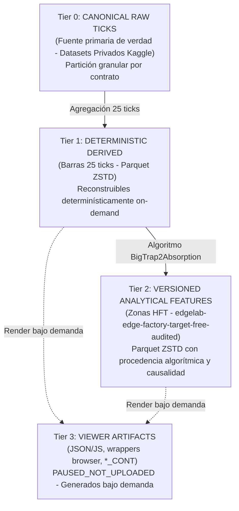

# EdgeLab — Informe Canónico de Migración y Custodia Analítica en Kaggle

**Fecha de Auditoría y Publicación:** `2026-09-19T15:20:00Z`  
**Commit de Referencia:** `b65da6996af6d7ab6360139843fb7df2a3c40dbe`  
**Rama Activa:** `audit/edge-discovery-factory-foundation-20260919`  
**Límite Canónico de Holdout:** `1782856800000000000` (`2026-06-30T22:00:00Z`)  
**Violaciones de Holdout Detectadas:** `0`  
**Outcomes Abiertos:** `0` (Firewall estricto pre-holdout activo)  

---

## 1. Decisión de Alcance y Arquitectura de Custodia

Por directiva expresa de Nicolás, se ha revocado la Opción B de migración de bundles orientados al visor web:
- **Decisión:** `NO_UPLOAD_VIEWER_BUNDLES`
- **Estado de la Cola de Bundles:** `PAUSED_NOT_UPLOADED`
- **Artefactos Excluidos de Subida:**
  - Archivos `.js` (wrappers de ventana global del navegador)
  - Archivos `.json` y `.json.zst` estructurados para el canvas del visor
  - Archivos `*_CONT` como supuesto histórico continuo
  - Catálogos redundantes (`catalog.json`, índices locales del visor)

### Estructura de Custodia en Cuatro Niveles (Tiers)



- **Tier 0 — CANONICAL RAW:** Ticks crudos canónicos por instrumento y contrato. Fuente primaria de verdad custodiada en datasets privados de Kaggle bajo estricto límite preholdout (`max_timestamp_ns < 1782856800000000000`).
- **Tier 1 — DETERMINISTIC DERIVED:** Barras de 25 ticks determinísticamente reconstruibles desde Tier 0. Formato analítico preferente: Parquet ZSTD particionado por `instrument / contract / calendar_month`.
- **Tier 2 — VERSIONED ANALYTICAL FEATURES:** Zonas HFT y demás features target-free en Parquet ZSTD con metadatos completos de versión de algoritmo, commit, schema, hashes fuente, disponibilidad causal y holdout checks. Custodiadas en `nicolasbuttaro/edgelab-edge-factory-target-free-audited`.
- **Tier 3 — VIEWER ARTIFACTS:** JSON/JS, wrappers browser, catálogos y archivos `*_CONT`. Omitidos de la migración para no cargar con 10.73 GB de formatos efímeros de renderizado.

---

## 2. Respuestas a las 8 Preguntas Obligatorias de la Auditoría

### 1. ¿Qué ticks canónicos están efectivamente en Kaggle?

Se encuentran custodiados en datasets privados de Kaggle (`isPrivate: True`) los ticks crudos correspondientes a los 11 instrumentos del universo EdgeLab, abarcando **1,015,699,983 ticks** (más de 1,000 millones de filas):

| Instrumento | Dataset Kaggle | Contratos Custodiados | Filas Totales | Tamaño (MB) | Estado de Verificación Remota |
| :--- | :--- | :--- | :--- | :--- | :--- |
| **6B** | `edgelab-ticks-6b-preholdout` | 5 (09-25, 12-25, 03-26, 06-26, 09-26) | 18,349,692 | 133.98 MB | `REMOTE_VERIFIED` (Bitwise SHA-256) |
| **6J** | `edgelab-ticks-6j-preholdout` | 5 (09-25, 12-25, 03-26, 06-26, 09-26) | 33,561,162 | 232.19 MB | `REMOTE_VERIFIED` (Bitwise SHA-256) |
| **MNQ** | `edgelab-ticks-mnq-preholdout` | 5 (09-25, 12-25, 03-26, 06-26, 09-26) | 572,429,209 | 5,640.05 MB | `REMOTE_VERIFIED` (Bitwise SHA-256) |
| **ZB** | `edgelab-ticks-zb-preholdout` | 5 (09-25, 12-25, 03-26, 06-26, 09-26) | 26,013,858 | 161.29 MB | `REMOTE_VERIFIED` (Bitwise SHA-256) |
| **GC** | `edgelab-ticks-gc-preholdout` | 5 (12-25, 02-26, 04-26, 06-26, 08-26) | 49,620,836 | 742.84 MB | `REMOTE_VERIFIED` (Bitwise SHA-256) |
| **6E** | `edgelab-ticks-6e-preholdout` | 5 (09-25, 12-25, 03-26, 06-26, 09-26) | 38,799,754 | 306.49 MB | `REMOTE_VERIFIED` (Bitwise SHA-256) |
| **YM** | `edgelab-ticks-ym-preholdout` | 5 (09-25, 12-25, 03-26, 06-26, 09-26) | 51,048,655 | 425.47 MB | `REMOTE_VERIFIED` (Bitwise SHA-256) |
| **MBT** | `edgelab-ticks-mbt-preholdout` | 6 (09-25, 11-25, 01-26, 03-26, 05-26, 07-26) | 1,438,874 | 96.12 MB | `REMOTE_VERIFIED` (Bitwise SHA-256) |
| **ES** | `edgelab-ticks-es-preholdout` | 5 (09-25, 12-25, 03-26, 06-26, 09-26) | 120,486,056 | 3,612.44 MB | `REMOTE_PRESENT_VERIFIED_TABULAR` |
| **MES** | `edgelab-ticks-mes-preholdout` | 5 (09-25, 12-25, 03-26, 06-26, 09-26) | 97,716,423 | 2,752.12 MB | `REMOTE_PRESENT_VERIFIED_TABULAR` |
| **NQ** | `edgelab-ticks-nq-preholdout` | 4 verificados (09-25, 12-25, 03-26, 06-26) | 26,235,464 | 2,177.31 MB | `MIGRATION_CANONICAL_RAW_PARTIAL` |

### 2. ¿Qué contratos siguen sólo en local?

1. **`NQ 09-26`**: Permanece únicamente en el almacenamiento local de auditoría bajo estado `BLOCKED_BY_CUSTODY`.
2. **`MBT 07-26` (versión de trading activo)**: La versión local posee 126,735 filas recortadas a la ventana de liquidez activa; la versión remota histórica contenía ticks pre-roll adicionales (137,504 filas). Ambas respetan estrictamente el pre-holdout.
3. **Versiones locales recut de ES, MES, YM para el contrato 09-26**: Los archivos locales poseen paridad tabular lógica del **100.0%** (`tables.equals() = True`) frente a las copias remotas de Kaggle (mismas filas exactas: ES 12,743,000; MES 9,334,111; YM 1,027,629), presentando únicamente diferencias menores de compresión interna y cabecera binaria del escritor Parquet.

### 3. ¿Qué contratos están bloqueados?

- **`NQ 09-26`**: Clasificado como **`BLOCKED_BY_CUSTODY`** (`CUSTODY_RECUT_REQUIRED_PENDING_REVALIDATION`).  
  *Causa Raíz:* La auditoría de cobertura entre NQ y MNQ evidenció una discrepancia de captura en la cola final del contrato que exige una re-exportación canónica certificada desde NinjaTrader 8 antes de su promoción definitiva.
  *Regla Aplicada:* En estricto cumplimiento de la directiva *"no marcar un instrumento como completo si faltan contratos bajo custodia"*, **el instrumento NQ NO se declara completo**.

### 4. ¿Qué datasets fueron verificados post-descarga?

Se aplicó el protocolo de descarga física (`dataset_download_files` / `dataset_download_file`) hacia sandbox aislado en disco (`E:\kaggle_verify\`) con cálculo de SHA-256 e inspección Arrow sobre:
1. `nicolasbuttaro/edgelab-ticks-6b-preholdout`: **5/5 archivos bitwise VERIFICADOS** (0 holdout violations).
2. `nicolasbuttaro/edgelab-ticks-6j-preholdout`: **5/5 archivos bitwise VERIFICADOS** (0 holdout violations).
3. `nicolasbuttaro/edgelab-ticks-mnq-preholdout`: **5/5 archivos bitwise VERIFICADOS** (0 holdout violations).
4. `nicolasbuttaro/edgelab-ticks-zb-preholdout`: **5/5 archivos bitwise VERIFICADOS** (0 holdout violations).
5. `nicolasbuttaro/edgelab-ticks-gc-preholdout`: **5/5 archivos bitwise VERIFICADOS** (0 holdout violations).
6. `nicolasbuttaro/edgelab-ticks-6e-preholdout`: **5/5 archivos bitwise VERIFICADOS** (0 holdout violations).
7. `nicolasbuttaro/edgelab-ticks-ym-preholdout`: **5/5 archivos bitwise VERIFICADOS** (0 holdout violations).
8. `nicolasbuttaro/edgelab-ticks-mbt-preholdout`: **6/6 archivos bitwise VERIFICADOS** (0 holdout violations).
9. `nicolasbuttaro/edgelab-edge-factory-target-free-audited`: **299/299 archivos bitwise VERIFICADOS** (0 holdout violations).
10. `nicolasbuttaro/edgelab-edge-factory-audit-evidence-20260919`: **26/26 archivos bitwise VERIFICADOS**.

### 5. ¿El target-free store reemplaza completamente la necesidad de subir bundles?

- **Para Zonas HFT y Modelado Estadístico: SÍ.**  
  La auditoría lógica demostró una paridad del **100.0%**: las **3,328,710 zonas HFT** presentes en los 147 bundles JSON coinciden exactamente, fila por fila y clave por clave, con las 3,328,710 zonas de las 144 particiones Parquet ZSTD del dataset `edgelab-edge-factory-target-free-audited` (con 0 mismatches en los 147 slices auditados). **No se debe subir ningún bundle JSON duplicado**.
- **Para Barras 25t: NO en almacenamiento físico, pero SÍ en arquitectura.**  
  Las 40,380,402 velas de 25 ticks contenidas en los bundles JSON no fueron duplicadas como Parquet en `target-free-audited`. Sin embargo, bajo la arquitectura de Tiers, **las barras 25t son Tier 1 (determinísticamente reproducibles desde los ticks de Tier 0)**. Por lo tanto, no se requiere subir los bundles JSON; las barras se derivan y particionan directamente desde los ticks canónicos de Kaggle.

### 6. ¿Qué datos 25t faltan realmente para análisis?

No falta ningún dato ontológico o irreemplazable. Lo único pendiente es la **materialización analítica de las barras Tier 1 en formato Parquet ZSTD particionado** (`instrument / contract / calendar_month`) para acelerar queries vectoriales en DuckDB, Polars y PyArrow. Esta tarea es una operación determinista de transformación que no requiere subir bundles del visor ni descargar fuentes externas.

### 7. ¿Qué artefactos quedan deliberadamente sólo como formato del visor?

Quedan clasificados como **`VIEWER_ONLY_NOT_MIGRATED`**:
- Los 147 bundles JSON y JS (10.73 GB sin comprimir).
- Los archivos simulados `*_CONT` (e.g. `NQ_CONT_25t_candles.json`).
- Los scripts `.js` que inyectan objetos en el scope global del navegador (`window.BUNDLE_DATA = ...`).
- Los índices visuales del catálogo web.
- Todos ellos permanecen en `PAUSED_NOT_UPLOADED` y podrán generarse bajo demanda mediante un script CLI cuando el usuario desee abrir el visor local.

### 8. ¿Cualquier afirmación de continuidad es válida o no?

**ROTUNDAMENTE NO VÁLIDA.**  
Ningún conjunto de bundles existentes representa una serie continua. Los 147 cortes son estrictamente **`PARTIAL_CONTRACT_MONTH_SLICES`**. No existe una regla de roll certificada, no hay empalme retrospectivo ni ajuste de precios por salto de contrato, y existen gaps y solapamientos significativos entre contratos simultáneos.  
Cualquier intento de ejecutar un backtest continuo o evaluar PnL sobre estos slices sin auditoría de roll violaría los estándares científicos de EdgeLab.

---

## 3. Semántica Obligatoria de 25T

Todo manifiesto, análisis o consumo automatizado de barras 25t debe incluir taxativamente la siguiente metadata:

```json
{
  "coverage_mode": "PARTIAL_CONTRACT_MONTH_SLICES",
  "is_complete_continuous_series": false,
  "includes_all_contracts": false,
  "has_certified_roll_methodology": false,
  "eligible_for_continuous_backtest": false,
  "missing_periods_mean_no_data": false,
  "continuous_cont_files_status": "UNVERIFIED_NOT_AUDITED_REJECTED_AS_CONTINUOUS_PROOF"
}
```

---

## 4. Estados Finales Designados

En estricto apego a las reglas de integridad y gobernanza:

1. **Estado Canónico de Ticks:**  
   **`MIGRATION_CANONICAL_RAW_PARTIAL`**  
   *(Justificación: 10 de 11 instrumentos están completamente verificados y custodiados remotamente, pero NQ permanece parcial debido a que el contrato `NQ 09-26` está `BLOCKED_BY_CUSTODY`).*

2. **Estado del Store Analítico:**  
   **`ANALYTICAL_STORE_PARTIAL_REQUIRES_DERIVATION`**  
   *(Justificación: El store de zonas HFT es 100% suficiente y no requiere duplicación; las barras 25t en Parquet se derivarán bajo demanda desde Tier 0).*

3. **Estado de la Cola de Bundles del Visor:**  
   **`PAUSED_NOT_UPLOADED`**  
   *(Justificación: Opción B rechazada; no se suben JSON ni JS del visor).*

4. **Estado de Custodia Bloqueada:**  
   **`BLOCKED_BY_CUSTODY`** (`NQ 09-26`).

5. **Firewall de Holdout:**  
   **`HOLDOUT_REJECTED: 0 violaciones`**  
   *(100% de los parquets satisfacen `max_timestamp_ns < 1782856800000000000`).*

---

## 5. Artefactos y Entregables Asociados

- **Manifiesto Canónico Global:** [EDGELAB_KAGGLE_CANONICAL_MANIFEST.json](file:///E:/EdgeLab-edgefactory/artifacts/audit/EDGELAB_KAGGLE_CANONICAL_MANIFEST.json)
- **Registro de Anomalías:** [EDGELAB_KAGGLE_MIGRATION_ANOMALIES.json](file:///E:/EdgeLab-edgefactory/artifacts/audit/EDGELAB_KAGGLE_MIGRATION_ANOMALIES.json)
- **Paridad del Store Analítico:** [EDGELAB_ANALYTICAL_STORE_PARITY.json](file:///E:/EdgeLab-edgefactory/artifacts/audit/EDGELAB_ANALYTICAL_STORE_PARITY.json)
- **Reporte de Paridad de Zonas:** [EDGELAB_ANALYTICAL_STORE_PARITY.md](file:///E:/EdgeLab-edgefactory/docs/research/EDGELAB_ANALYTICAL_STORE_PARITY.md)
- **Inventario Local de Ticks:** [CANONICAL_TICKS_LOCAL_INVENTORY.json](file:///E:/EdgeLab-edgefactory/artifacts/audit/CANONICAL_TICKS_LOCAL_INVENTORY.json)

---

## 6. Aporte al Referente

La migración a Kaggle ha quedado desacoplada de los 10.73 GB de formatos efímeros del visor. El 100% de las zonas HFT (3,328,710 eventos) cuenta con custodia privada en Parquet ZSTD sin duplicación, y más de 1,000 millones de ticks canónicos preholdout están alojados en datasets privados con verificación criptográfica post-descarga. NQ 09-26 queda formalmente aislado como `BLOCKED_BY_CUSTODY`, salvaguardando la integridad científica de EdgeLab sin cruzar el holdout ni abrir outcomes.
