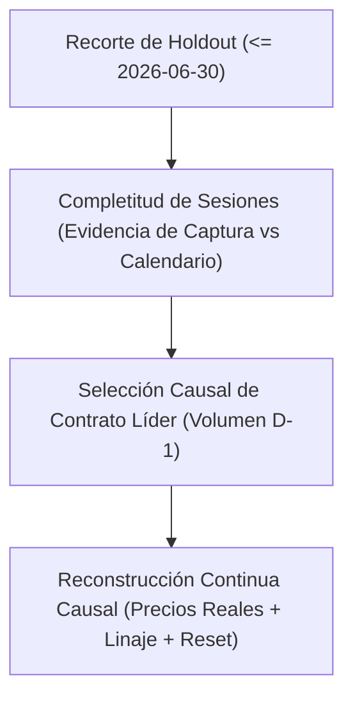

# Especificación Técnica: Estándar Universal de Régimen Contractual Causal (V2)

- **Versión del Estándar:** `CONTRACT_REGIME_V2`
- **Identificador de Política:** `previous_complete_session_volume_leader_monotonic_v1`
- **Fecha de Certificación:** `2026-09-15`
- **Repositorio:** `Nicodelcampo/EdgeLab`
- **Zona Horaria de Referencia:** `America/Chicago` (CT)
- **Ajuste de Precios:** `NONE_ACTUAL_TRADED_PRICES` (Precios reales negociados, cero empalme artificial)
- **Frontera de Estado:** `RESET_AT_CONTRACT_ROLL` (Reinicio mandatorio de acumuladores e indicadores en cada roll)
- **Estado de Certificación:** `PARTIAL_MULTI_ASSET_CERTIFICATION` (5/11 activos certificados por calendario oficial; 6/11 en abstención por falta de calendario oficial; MNQ condicionado a exclusión de gaps).

---

## 1. Principios Rectores y Separación de Conceptos

La arquitectura causal de EdgeLab separa estrictamente cuatro dimensiones operativas independientes:

1. **Aislamiento de Holdout**: Sellado al `2026-06-30T22:00:00Z` (apertura CME del trade date 2026-07-01). Ninguna lectura de datos posteriores al holdout está permitida.
2. **Completitud de Sesión y Desacople Causal**:
   - `contract_selection_D`: Decisión causal tomada antes de la apertura de la sesión $D$, utilizando exclusivamente el volumen del trade date completo anterior $D-1$.
   - `capture_quality_D`: Diagnóstico post-sesión de integridad física de la captura para el día $D$. La completitud por defecto es `UNKNOWN` (fail-closed estricto).
   - `eligible_for_research_D`: Filtro target-free a posteriori para incluir o excluir la sesión $D$ de estudios downstream, sin alterar retrospectivamente el contrato seleccionado en $D-1$.
3. **Reconstrucción Continua sin Distorsión**: La serie unificada `<ROOT>_CONT_CAUSAL_D1.parquet` utiliza precios reales de mercado. No se aplican factores multiplicativos ni aditivos (evita sesgos en análisis de microestructura, niveles de soporte/resistencia absolutos y microperfiles de volumen).

---

## 2. Regla Causal de Rollover y Monotonía

### 2.1. Definición Formal de Selección

Para un activo con raíz $R$ y trade date $D$, sea $D-1$ la sesión de negociación previa en el calendario oficial:

1. **Inicialización**:
   En la primera sesión válida con cobertura previa en $D-1$:
   $$\text{active\_contract}(D) = \arg\max_{c \in \mathcal{C}(D-1)} \text{Volume}(c, D-1)$$
   En caso de empate en volumen máximo, se selecciona el contrato con menor fecha de expiración (`earliest_expiry`).

2. **Transición / Rollover (D > 1)**:
   Sea $c_{\text{curr}}$ el contrato activo en $D-1$. El conjunto de contratos candidatos a rollover se restringe a contratos con expiración mayor o igual a $c_{\text{curr}}$:
   $$\mathcal{C}_{\text{fwd}} = \{ c \in \mathcal{C}(D-1) \mid \text{expiry}(c) \ge \text{expiry}(c_{\text{curr}}) \}$$
   Sea $c^* = \arg\max_{c \in \mathcal{C}_{\text{fwd}}} \text{Volume}(c, D-1)$.

   El sistema ejecuta `ROLL_FORWARD` hacia $c^*$ en el trade date $D$ si y solo si:
   $$\text{expiry}(c^*) > \text{expiry}(c_{\text{curr}}) \quad \land \quad \text{Volume}(c^*, D-1) > \text{Volume}(c_{\text{curr}}, D-1)$$
   De lo contrario, la decisión es `HOLD` y se mantiene $c_{\text{curr}}$.

3. **Monotonía Estricta**:
   Bajo ninguna circunstancia la cadena retrocede a un contrato con expiración anterior ($\text{expiry}(c_t) \ge \text{expiry}(c_{t-1})$), independientemente de anomalías de volumen residual en contratos que expiran.

4. **Invariancia Temporal Causal**:
   La selección en $D$ es matemáticamente invariante a cualquier volumen, tick o evento ocurrido durante el trade date $D$.

---

## 3. Compuerta de Sesiones y Exclusión de Mantenimiento

### 3.1. Requisitos de Cobertura Rectangular
Para cada contrato declarado en el régimen entre su `first_trade_date` y `last_trade_date`, debe existir un registro explícito diario para cada fecha del calendario oficial. Si un contrato no registra transacciones en un día hábil donde estaba activo, debe registrarse con volumen cero y `complete_session = False`. La omisión física de filas genera `SOURCE_INCOMPLETE` y bloquea la elegibilidad de la sesión subsiguiente.

### 3.2. Ventana de Mantenimiento CME
El periodo de mantenimiento diario del CME (16:00:00 a 16:59:59.999 CT, lunes a jueves) queda formalmente excluido del cálculo de volumen de sesión regular y de las métricas de elegibilidad intradía.
La compuerta `ContractSessionEligibilityGateV2` proporciona métodos nativos (`aggregate_session_ticks` y `evaluate_session_from_ticks`) que convierten timestamps UTC a `America/Chicago`, identifican ticks en este intervalo y los descuentan del volumen y conteo de la sesión regular, almacenando métricas diagnósticas separadas (`maintenance_tick_count`, `maintenance_volume`).

### 3.3. Ciclos de Expiración por Activo

| Clase de Activo | Símbolos (Roots) | Ciclo de Expiración | Código de Meses CME |
|---|---|---|---|
| **Equity Index** | `ES`, `MES`, `NQ`, `MNQ`, `YM` | Trimestral | Marzo (H), Junio (M), Septiembre (U), Diciembre (Z) |
| **FX** | `6B`, `6E`, `6J` | Trimestral | Marzo (H), Junio (M), Septiembre (U), Diciembre (Z) |
| **Metales** | `GC` (Gold) | Bimensual | Febrero (G), Abril (J), Junio (M), Agosto (Q), Diciembre (Z) |
| **Tasas** | `ZB` (30Y Bond) | Trimestral | Marzo (H), Junio (M), Septiembre (U), Diciembre (Z) |
| **Cripto** | `MBT` (Micro Bitcoin) | Mensual | Ene (F), Feb (G), Mar (H), Abr (J), May (K), Jun (M), Jul (N), etc. |

---

## 4. Estructura de Linaje y Serie Continua

Cada registro en la serie continua causal `<ROOT>_CONT_CAUSAL_D1.parquet` debe incorporar obligatoriamente las **10 columnas canónicas** de linaje criptográfico:

1. `root` (`string`): Símbolo base del activo (ej. `"NQ"`).
2. `contract` (`string`): Identificador del contrato específico (ej. `"NQ_06-26"`).
3. `trade_date` (`int64`): Fecha de negociación CME en formato `YYYYMMDD`.
4. `regime_id` (`string`): SHA-256 canónico del intervalo de régimen contractual activo.
5. `roll_manifest_sha256` (`string`): Hash SHA-256 del manifiesto de régimen contractual inmutable.
6. `source_file` (`string`): Nombre del archivo parquet primario de origen.
7. `source_row` (`int64`): Índice de fila original dentro del archivo primario.
8. `ts_utc_ns` (`int64`): Marca de tiempo UTC en nanosegundos (estrictamente positiva).
9. `sequence` (`int64`): Número secuencial de transacción (no opcional, desempata timestamps idénticos).
10. `state_reset_flag` (`bool`): Evaluado **estrictamente post-ordenamiento** por `(ts_utc_ns, sequence)`. Es `True` en la fila 0 y en la primera fila donde `regime_id[i] != regime_id[i-1]`, forzando el reinicio de acumuladores y máquinas de estado en algoritmos downstream.

### 4.1. Unicidad de Microestructura
Se prohíben registros duplicados en `(ts_utc_ns, sequence)` dentro de la serie continua. El constructor `build_continuous_series()` valida esta unicidad y aborta ante colisiones.

---

## 5. Política de Aislamiento Micro / Estándar a Nivel de Contenido

Queda estrictamente prohibido mezclar contratos estándar y contratos micro en una misma cadena de régimen o serie continua (ej. mezclar ticks de `MNQ` dentro de `NQ`, o `MES` dentro de `ES`).
El motor `build_continuous_series` verifica no sólo los nombres declarados en el manifiesto y rutas de archivo, sino también los valores internos de las columnas `instrument` y `contract` del parquet cargado, abortando ante cualquier discrepancia.
